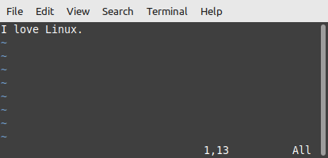

# How to Use the Vim Text Editor

<h3 align="center" id="author">
   Written by <a href="https://www.linkedin.com/in/profpan396/">Amar Pan, M.Ed.</a> 
   </h3>
   
Technical Writer @ Linode 

   

       

 
      

  
      

#### ***If you find this tutorial helpful, please consider giving it a :star:

## Introduction 
Vim is a text editor used for editing plain text and code-based programs. This tutorial teaches how to open, edit, and save a plain text file in Vim as well as how to use more advanced command shortcuts.

## Why Use Vim
Vim offers a rich selection of keyboard-based shortcuts that make editing, inserting, deleting, and searching for specific use-cases speedy and efficient.

## Background Information
Derived from the original Vi text editor, Vim stands for "Vi IMproved". 
Notable differences between Vi and Vim are:

1. Multi-level Undo
2. Multiple Windows Mode
3. Syntax Highlighting

## Modes - Input and Command
Vim has two main modes of operation: insert and command.
### 1. Insert Mode
In insert mode, anything typed by the user is output to the opened file. However, the user can not give shortcut commands to alter text or return to the command line. 
 
For example, a user would use insert mode to type up a paragraph. However, a user would and could not use insert mode to give a command like `dl` to delete the line the cursor is on. 

Press `i` to enter insert mode.
 
Press `ESC` to exit insert mode and enter command mode.

**Note:** Insert mode can be verified if an "-- INSERT --" message is shown in the bottom-left hand corner of the screen.

### 2. Command Mode (Default)
In command mode, anything typed by the user is processed as shortcut commands to alter the contents of the file in some shape or form. While in command mode, Vim does not input plain text into the file itself.

For example, a user would use command mode to input a command like `dl` to delete the line the cursor is on. A user would not use command mode to type up a paragraph.

## How to Use - The Basics
| Step | Instructions | Screenshot  |
|:------------:|:-----:|:-----------:|
| 1. Create a new file and open it in Vim.  | Type `vim note.txt` | 
| 2. Enter input mode. | Press the `i` key. |     **Note**: The -- INSERT -- status message in the bottom-left corner signals to us that we can now insert text.
| 3. Write in some text. | Type in a message  Example: I love Linux! |   
| 4. Exit insert mode. | Press the `ESC` key.   |     **Note**: The -- INSERT -- message has now dissapeared.
| 5. Write the file to the disk (save it). | Type `:w` + `ENTER`   |       **Note:** The "w" in :w stands for "write", and we can see the file is now officially written to the disk, meaning saved. 
| 6. Quit Vim and return back to the command line. | Type `:q` + `ENTER`  |      Alternatively, typing `:wq` + `ENTER` writes the file and quits to the command line is one step. 

## Advanced Command Shortcuts

The best thing about Vim are its shortcuts.
 
**Warning:** Vim is case-sensitive, meaning it interprets the same letter as two different commands based on upper or lower casing. 

### Navigation
While navigation using the directional cursor keys or mouse is supported, it is recommended to use the following letter keys for quicker access to keyboard-based shortcuts:

|      Event      |    Command    
|:---------------:|:---------------:
| Up              |`k`        
| Left            |`h`
| Down            |`j` 
| Right           |`l`
| Scroll up half a window   |`CTRL-U`
| Scroll down half a window | `CTRL-D`

### Deleting Text
Move the cursor over the desired text and use the following: 
**Note**: The following commands can also be prepended with a number for a multiplied effect.
|      Event      |    Command    
|:---------------:|:--------------:
|Delete character |`x`
|Delete word      |`dw`
|Delete line      |`dd`
|Undo last operation |`u` 
|Redo last operation  |`CTRL-R`  or  `:redo` + `ENTER`

### Entering Text
|      Event      |    Command    
|:---------------:|:--------------:
|Insert blank line above and enter insert mode        |`O`
|Insert blank line below cursor and enter insert mode |`o`

### Useful Commands
|      Event      |    Command    
|:---------------:|:--------------:
Force quit without saving | `:q!` + `ENTER` 
Display line numbers      | `:set number` + `ENTER` 
Turn off line numbers     | `:set nonumber` + `ENTER` 
View help guides          | `:help`   

### Moving the Cursor by Criteria
Move the cursor to the...
|      Event      |    Command    
|:---------------:|:--------------:
next occurence of a specific character on the current line | `f` + `character`  
previous occurence of a specific character on the current line | `F` + `character` 
beginning of the next word | `w`
beginning of the previous word | `b`
end of the next word | `e` 
beginning of the next sentence | `)`
beginning of the current sentence | `)`
beginning of the next paragraph | `}`
beginning of the current paragraph | `{`
top line of the screen | `H`
middle line of the screen | `M`
bottom line of the screen | `L` 

## Searching for a String
|      Event      |    Command    
|:----------------:|:--------------:
Find the next occurence of a string | `/` + `string` + `ENTER`  
Find the previous occurence of a string | `?` + `string` + `ENTER` 
Repeat the last search | `n`  
Repeat the last search in the opposite direction | `N` 

#### ***If you found this tutorial helpful, please consider giving it a :star:

</div

