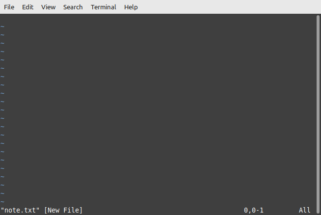
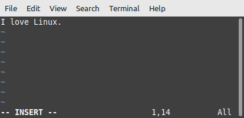
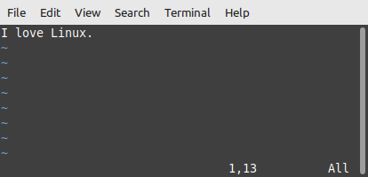
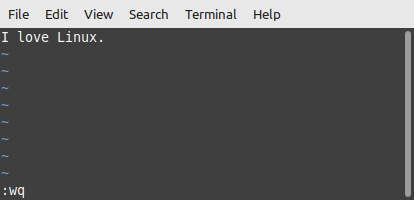
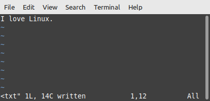
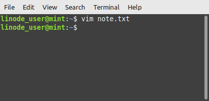

<!-- 
***Rememember this isn't your first rodeo - readme-writing-tutorial was your first rodeo and that was super successful!
1. Write it according to PYC Style Guidelines (also gives you sellability to other clients as well as your own branding revenue on panyoucan.org or gatips.com blog)
2. Change specs to adhere to Linode Style Guidelines
--> 


<div align="center">

# Introduction to the Vim Text Editor
<h3 align="center" id="author">
   Written by <a href="https://www.linkedin.com/in/profpan396/">Professor Pan, M.Ed.</a><br> 
   <div align="center">
<a href="https://profpan396.github.io/portfolio" target="_blank">
        
      </a>
<a href="mailto:profpan396@gmail.com" target="_blank">
    
 </a>
 <a href="https://www.github.com/profpan396/" target="_blank">
        
      </a>

 <a href="https://www.linkedin.com/in/profpan396/" target="_blank">
      
 </a> 
  <a href="https://medium.com/@profpan396">
    
 </a>
 <a href="https://twitter.com/profpan396" target="_blank">
      
 </a>


 </h3>


</div>

## What Vim Is and Isn't 
Vim is an advanced text editor used best for quick notes and writing code. It does not, however, format text and represent the same features as word processing software suites. 

## Background Information
Vim is derived from the original Vi text editor, and stands for "vi-improved". 
Major differences between Vi and Vim are:

1. 
2. 
3. 

## Modes - Command and Input
Vim has two main modes of operation - Command and Input Mode. 
### Command Mode
In command mode, the user can give shortcut commands to delete text or exit back to the command line. However, the user cannot enter typed text in this mode.
### Input Mode
In input mode, 

## How to Use - The Basics
Vim should come pre-installed with every Linux distribution, but just in case it is not, run the following command: 
```sudo ________ ```

| Instructions | Screenshot |
|------------ | ------------|
| 1. Create a new file and open it in Vim. <br>
Run ```vim note.txt``` |  <br> The new file is created and opened directly in the terminal.
| 2. Enter input mode to enable the ability to add text. <br>
Press the ```i``` key. |  <br> The -- INSERT -- status message in the bottom-left corner signals to us that we can now insert text. Before this, entering text did absolutely nothing.
| 3. Write in some text. <br>
Type in a message <br> Example: I love Linux! |  <br> 
| 4. Exit insert mode. <br>
Press the ```ESC``` key.  <br> |  <br> Note: The -- INSERT -- message has now dissapeared.
| 5. Write the file to the disk (save it). <br>
Type ```:w``` + ```ENTER```  <br> |  <br>  <br> The "w" in :w stands for "write", and we can see the file is now officially written to the disk, meaning saved. 
| 6. Quit vim and return back to the command line. <br>
Type ```:q``` + ```ENTER``` <br> |  <br>  

## How to Use - Advanced Shortcuts


