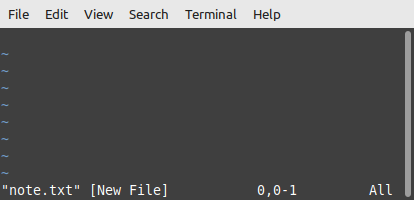
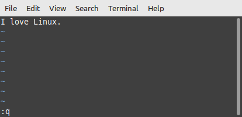

<!-- 
***Rememember this isn't your first rodeo - readme-writing-tutorial was your first rodeo and that was super successful!
1. Write it according to PYC Style Guidelines (also gives you sellability to other clients as well as your own branding revenue on panyoucan.org or gatips.com blog)
2. Change specs to adhere to Linode Style Guidelines
--> 


<div align="center">

# Introduction to the Vim Text Editor
<h3 align="center" id="author">
   Written by <a href="https://www.linkedin.com/in/profpan396/">Professor Pan, M.Ed.</a><br> 
   <div align="center">
<a href="https://profpan396.github.io/portfolio" target="_blank">
        
      </a>
<a href="mailto:profpan396@gmail.com" target="_blank">
    
 </a>
 <a href="https://www.github.com/profpan396/" target="_blank">
        
      </a>

 <a href="https://www.linkedin.com/in/profpan396/" target="_blank">
      
 </a> 
  <a href="https://medium.com/@profpan396">
    
 </a>
 <a href="https://twitter.com/profpan396" target="_blank">
      
 </a>


 </h3>


</div>

## What Vim Is and Isn't 
Vim is an advanced text editor used for editing plain text and code-based programs. It does not, however, format text and offer the same features as word processing software suites. 

## Background Information
Vim is derived from the original Vi text editor, and stands for "Vi IMproved". 
Major differences between Vi and Vim are:

1. Multi-level Undo
2. Multiple Windows Mode
3. Syntax Highlighting

## Modes - Command and Input
Vim has two main modes of operation - Command and Insert Mode. 
### Command Mode
In command mode, the user can give shortcut commands to alter text or exit back to the command line. However, the user can not enter typed text.
### Insert Mode
In insert mode, anything typed by the user is output to the opened file. However, the user cannot give shortcut commands to alter text or return to the command line. <br><br>
Press ```i``` to enter input mode and an -- INSERT -- message will appear in the bottom-left hand corner. 
Press ```ESC``` to exit input mode and enter command mode.

## How to Use - The Basics
Vim should come pre-installed with every Linux distribution, but just in case it is not, run the following command: 
```sudo ________ ```

| Step | Instructions | Screenshot  |
|------------ | ----- | ------------|
| 1. Create a new file and open it in Vim.  | Run ```vim note.txt``` |  <br> Note: The tildes (~) represent empty lines and dissapear as lines of text are added.  <br>
| 2. Enter input mode. | Press the ```i``` key. |  <br> The -- INSERT -- status message in the bottom-left corner signals to us that we can now insert text. Before this, entering text did absolutely nothing.
| 3. Write in some text. | Type in a message <br> Example: I love Linux! |  <br> 
| 4. Exit insert mode. | Press the ```ESC``` key.  <br> |  <br> Note: The -- INSERT -- message has now dissapeared.
| 5. Write the file to the disk (save it). | Type ```:w``` + ```ENTER```  <br> |  <br>  <br> The "w" in :w stands for "write", and we can see the file is now officially written to the disk, meaning saved. 
| 6. Quit vim and return back to the command line. | Type ```:q``` + ```ENTER``` <br> |  <br>  

## How to Use - Advanced Shortcuts

The best thing about vim are its shortcuts. 

### Navigation
While navigation using the directional cursor keys is supported, it is recommended to use the following letter keys for quicker access to command line shortcuts:

Up - ```k``` <br>
Left - ```h``` <br>
Down - ```j``` <br>
Right - ```l``` <br>


Warning: vim is case-sensitive, meaning it interprets the same letter as two different commands based on casing. 


